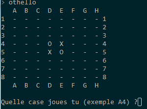

# Othello / Reversi

Histoire de mettre en pratique ce que l’on a vu, je vous propose de réaliser un petit jeu en mode console à l’ancienne.

Un semblant de cahier des charges :

## Description :

Jeu de stratégie à deux joueurs.
Il se joue sur un plateau de 64 cases (8 * 8).
Les joueurs disposent de 64 pions.
Les pions sont bicolores, une face noire une face blanche.
Les pions n’appartiennent pas à un joueur en particulier, on pioche suivant le besoin.

## But du jeu

Avoir le plus de pions à sa couleur.

## Position de départ 

Au début de la partie, deux pions noirs sont placés en e4 et d5 (X pour moi) et deux pions blancs sont placés en d4 et e5(O pour moi)

Noir commence toujours et les deux adversaires jouent ensuite à tour de rôle

## Règles

A son tour de jeu, le joueur doit poser un pion de sa couleur sur une case vide, adjacente à un pion adverse. Il doit également, en posant son pion, encadrer un ou plusieurs pions adverses entre le pion qu’il pose et un pion à sa couleur, déjà placé. Il retourne alors de sa couleur le ou les pions qu’il vient d’encadrer. Les pions ne sont ni retirés, ni déplacés d’une case à l’autre.

Pour plus de détails [voyez les règles du jeu](http://www.ffothello.org/othello/regles-du-jeu/).

## À faire

A faire (en vrac):

- Créer une grille, initialiser le plateau de jeu.
- Choix de jouer noir ou blanc.
- Vérifier si le coup joué est légal.
- Afficher le plateau de jeu.
- Afficher la saisie du coup.
- Afficher le score actuel.
- Affichage en mode scrolling pour le moment. (Voir avec le module colorama ou autre pour couleur et pas de scrolling)
- Une IA basique qui connais au moins les coups autorisés.
- Utiliser les classes, fonctions, etc.
- Commenter son code ;-)
- Prévoir d’abandonner la partie à n’importe quel moment.
- Choix joueur vs joueur / joueur vs AI. Et pourquoi pas AI vs AI pour opposer 2 programmes.

## Question subsidiaire

pour les matheux ;-)

Pour savoir quels pions sont retournables, à part faire des +1 -1 sur les indices je ne vois pas.

On se retrouve en fait avec un rose des vents avec 0 °, 45°, 90°, etc.
Il n’y a pas une astuce mathématique pour optimiser ce genre de truc ?

Je vois bien une réponse du genre :
« Mais oui, c’est simple ! c’est un parcours de Sheldon Cooper à deux dimensions. » ;-)
