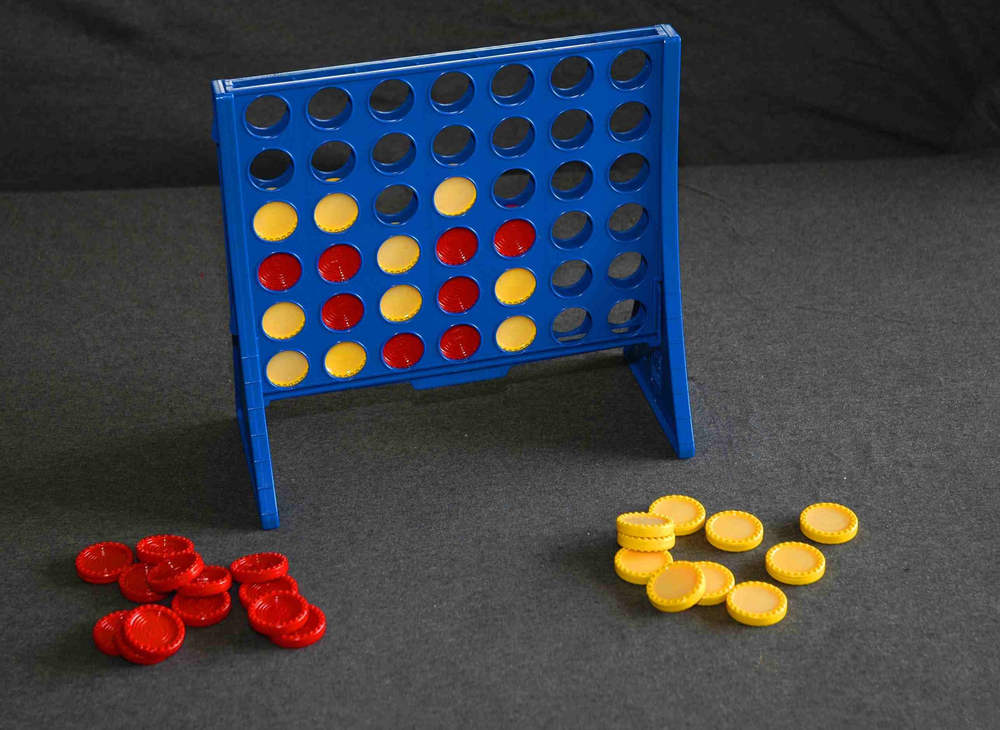

Le but du jeu Puissance4 (ou Connect 4) est de connecter 4 jetons d'une même couleur horizontalement, verticalement ou en diagonale dans un tableau de largeur 7 et de hauteur 6

Il se joue à 2 joueurs, chacun d'eux à tour de rôle choisit une colonne pour faire tomber son jeton.

