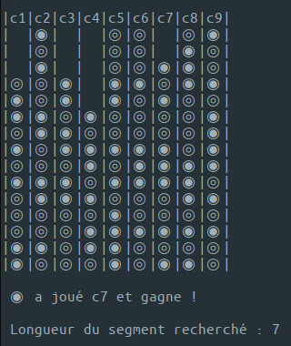

Exemple de lancement de `p4_rand_simu.py`  avec grille de largeur 9 et de hauteur 15 :

## Description des modules

### p4_config

module de configuration, contient des constantes d'initialisation

### p4_hci

module d'affichage, permet les interactions avec l'utilisateur

### p4_search

module de recherche de grille résolue

### p4_board

module de classe Board, gestion de la grille

### p4_player

module de classe Player, gestion du joueur, à spécialiser en joueur humain ou IA

### p4_rand_simu

module de simulation aléatoire de partie (2 joueurs machine jouant au hasard)

## À venir

### p4_ai
module d'IA (Intelligence Artificielle), utilisé par p4_player pour joueur IA

### p4_ai_simu
module de simulation de partie (2 joueurs IA jouant ensemble)

### puissance4
programme de jeu interactif, opposant l'utilisateur à l'IA
